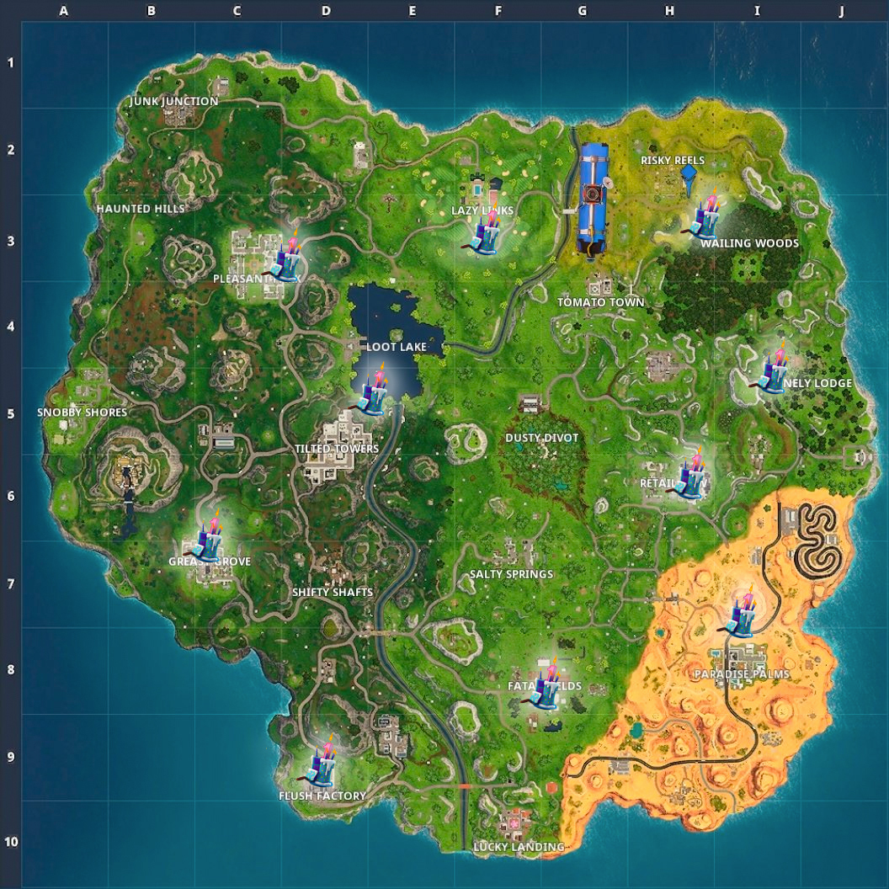

# fortnite_location_namer

## Context

A new Flutter application that generates lists of names for theoretical Fortnite locations.

The app presents users with an endlessly scrollable list of randomly generated Fortnite Location names, making use of the
alliteration and combination of adjective + location that has become synonymous with the immensely popular Battle Royale shooter.
Users are also able to tap on a location to save it to their favourites, which can be viewed at any time
by pressing the list icon in the top-right corner.

## The app in action

## Getting Started

Firstly, users will need to install [Flutter](https://flutter.io/). Flutter is Google's mobile app SDK for crafting high-quality native interfaces
on iOS and Android in record time. Offering Expressive and Flexible UI, Native Performance and Hot Reload in seconds for fast development, Flutter
offers developers of any skill level a framework for building mobile applications cross platform as an alternative to ReactNative. Although Flutter can
be used to build apps with any text editor + command line tools, superior results are experienced with one of the editor plugins offered, currently
offered for either [Android Studio](https://developer.android.com/studio/) or [VS Code](https://code.visualstudio.com/), information
on configuring your editor with Flutter plugins is available [here](https://flutter.io/get-started/editor/).

Secondly, users will need to install [Dart](https://www.dartlang.org/). The Dart Lang is what is used to write Flutter apps and is a client-optimized language
thtat offers rich, powerful frameworks and approachable syntax. Thanks to its unsurprising object orientation and syntax, developers
who are already familiar with C++, C#, or Java can be productive with Dart in just a few days.
